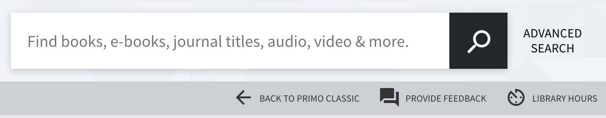

# primo-explore-search-bar-sub-menu

[](https://travis-ci.org/NYULibraries/primo-explore-search-bar-sub-menu)
[](https://www.npmjs.com/package/primo-explore-search-bar-sub-menu)
[](https://coveralls.io/github/NYULibraries/primo-explore-search-bar-sub-menu?branch=master)

## Description

Add a nav bar underneath the search bar to provide additional links in the primo-explore UI.

### Screenshot



## Installation

1. Assuming you've installed and are using [primo-explore-devenv](https://github.com/ExLibrisGroup/primo-explore-devenv).

2. Navigate to your template/central package root directory. For example:
    ```
    cd primo-explore/custom/MY_VIEW_ID
    ```
3. If you do not already have a package.json file in this directory, create one:
    ```
    npm init -y
    ```
4. Install this package:
    ```
    yarn add primo-explore-search-bar-sub-menu --dev
    # OR
    npm install primo-explore-search-bar-sub-menu --save-dev
    ```

## Usage

Once installed, inject `searchBarSubMenu` as a dependency:

```js
let app = angular.module('viewCustom', ['searchBarSubMenu'])
```

**Note:** If you're using the --browserify build option, you will need to first import the module with:

```js
import 'primo-explore-search-bar-sub-menu';
```

Then add the `search-bar-sub-menu` directive to the `prmSearchBarAfter` component:

```js
app.component('prmSearchBarAfter', {
  template: '<search-bar-sub-menu></search-bar-sub-menu>'
})
```

### Config

You'll need to configure the module by passing it an array of objects as an angular `constant`:

| name | type | usage |
|------|-------------|--------|
| `cssClasses` | string | extra css classes to put on the buttons, i.e. 'button-over-dark' if your background color is dark |
| `name` | string | the text that will appear as the button link |
| `description` | string | for the aria label |
| `action` | string | url for the link. always opens in a new window. |
| `icon` | object | defines the icon for the link. must be chosen from <https://material.io/icons/>. you need to specify both the name of the action "set" (see link) and the icon itself, in the form "ic_person_outline_24px". note that all icons do not work so you may have to experiment some |
| `show_xs` | boolean | true is you want to continue to show button text in xs screens and only show the icons. false by default |

### Translations

You can use translations to access back office text by wrapping the value in curly braces, e.g. `{nui.menu.librarycard}`. Anything that works in the primo templates link this `<span translate="nyu.menu.librarycard"></span>` will work if it's available in the current scope.

### Styles

Change the background color of the menu bar:

```css
search-bar-sub-menu div.search-bar-sub-menu {
  background-color: green !important;
}
```

Change the padding between the search bar the menu bar, these are the default values:

```css
prm-search-bar {
  padding-bottom: 58.5px;
}
.__sm prm-search-bar {
  padding-bottom: 49.5px;
}
.__xs prm-search-bar {
  padding-bottom: 36px;
}
```

Where `36px` is the default height of the menu bar.

### Example

```js
app.constant('searchBarSubMenuItems',
  [
    {
      name: "Back to Primo Classic",
      description: "Back to Primo Classic",
      action: "http://primo.school.edu/primo_library/libweb/action/search.do?vid=" + viewName,
      icon: {
        set: 'navigation',
        icon: 'ic_arrow_back_24px'
      },
      show_xs: true,
      cssClasses: 'button-over-dark'
    },
    {
      name: "Library Hours",
      description: "Library Hours",
      action: "https://school.edu/library-hours",
      icon: {
        set: 'av',
        icon: 'ic_av_timer_24px'
      },
      cssClasses: 'button-over-dark'
    }
  ]
);

```

## Tests

We are using Yarn to manage dev dependencies.

```
yarn
yarn test
```
